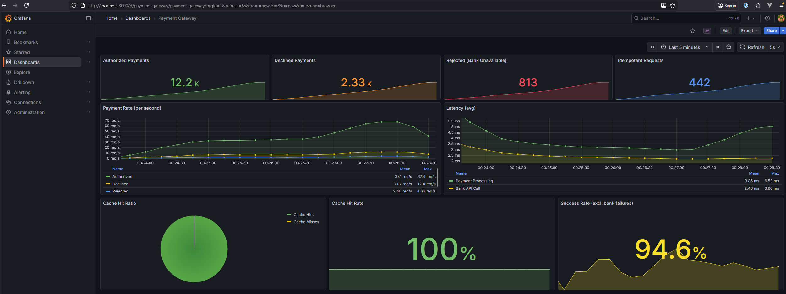

# Payment Gateway

A REST API for processing card payments and retrieving payment details.

## Requirements

- Java 25+
- Docker & Docker Compose
- Gradle 9.x

## Quick Start

```bash
# Start infrastructure and the application (PostgreSQL, Bank Simulator, Prometheus, Grafana)
docker-compose up -d

# Run tests
./gradlew test
```

## API Endpoints

| Method | Endpoint            | Description              |
|--------|---------------------|--------------------------|
| POST   | `/api/payment`      | Process a payment        |
| GET    | `/api/payment/{id}` | Retrieve payment details |

### Example: Process Payment

```bash
curl -X POST http://localhost:8090/api/payment \
  -H "Content-Type: application/json" \
  -H "Idempotency-Key: unique-key-123" \
  -d '{
    "card_number": "4111111111111111",
    "expiry_month": 12,
    "expiry_year": 2027,
    "currency": "USD",
    "amount": 1050,
    "cvv": "123"
  }'
```

### Example: Retrieve Payment

```bash
curl http://localhost:8090/api/payment/{id}
```

## API Documentation

Swagger UI: http://localhost:8090/swagger-ui/index.html

---

## Architecture

### POST /api/payment

#### Happy Path

```
┌────────┐     ┌─────────────┐     ┌───────┐     ┌────────────┐     ┌──────┐
│ Client │────▶│   Gateway   │────▶│ Cache │     │ PostgreSQL │     │ Bank │
└────────┘     └─────────────┘     └───────┘     └────────────┘     └──────┘
    │                │                  │               │               │
    │  POST /payment │                  │               │               │
    │───────────────▶│                  │               │               │
    │                │                  │               │               │
    │                │ Check idempotency (if key provided)              │
    │                │─────────────────▶│               │               │
    │                │                  │               │               │
    │                │    Validate request              │               │
    │                │──────────┐       │               │               │
    │                │          │       │               │               │
    │                │◀─────────┘       │               │               │
    │                │                  │               │               │
    │                │                  POST /payments  │               │
    │                │─────────────────────────────────────────────────▶│
    │                │                  │               │               │
    │                │                  │   Save payment│               │
    │                │─────────────────────────────────▶│               │
    │                │                  │               │               │
    │                │    Cache payment │               │               │
    │                │─────────────────▶│               │               │
    │                │                  │               │               │
    │    200 OK      │                  │               │               │
    │◀───────────────│                  │               │               │
```

### GET /api/payment/{id}

#### Happy Path

```
┌────────┐     ┌─────────────┐     ┌───────┐     ┌────────────┐
│ Client │────▶│   Gateway   │────▶│ Cache │     │ PostgreSQL │
└────────┘     └─────────────┘     └───────┘     └────────────┘
    │                │                  │               │
    │ GET /payment/id│                  │               │
    │───────────────▶│                  │               │
    │                │                  │               │
    │                │   Check cache    │               │
    │                │─────────────────▶│               │
    │                │                  │               │
    │                │   Cache miss     │               │
    │                │◀─────────────────│               │
    │                │                  │               │
    │                │      Query DB    │               │
    │                │─────────────────────────────────▶│
    │                │                  │               │
    │                │   Cache result   │               │
    │                │─────────────────▶│               │
    │                │                  │               │
    │    200 OK      │                  │               │
    │◀───────────────│                  │               │
```

> Full PlantUML diagrams: [docs/diagrams/](docs/diagrams/)

---

## Design Considerations

### 1. Minor Currency Units

Amounts are stored and returned as integers in minor units (cents). No conversion is performed - the
client sends `1050` for $10.50, we store `1050`, we return `1050`. This avoids floating-point
precision issues.

### 2. Card Number Security

Only the last 4 digits are stored and returned. Full card numbers are never persisted, reducing PCI
compliance scope.

### 3. Validation Strategy

Request validation happens at the gateway level using Bean Validation (JSR 380). Invalid requests
are rejected with `400 Bad Request` before calling the bank - this is the "Rejected" status
described in requirements.

### 4. Bank Integration

The bank client returns a sealed interface (`BankPaymentResult`) with two cases:

- `Success(authorized, authorizationCode)` - Bank responded
- `BankUnavailable(reason)` - Bank returned 503 or network error

This makes handling explicit and type-safe.

### 5. Idempotency (Header-based)

The `Idempotency-Key` header is optional. When provided:

- The same key returns the same payment (no duplicate processing)
- Protects against network retries

When not provided, each request creates a new payment.

---

## Extra features

| Feature               | Description                                |
|-----------------------|--------------------------------------------|
| **PostgreSQL**        | Real database instead of in-memory HashMap |
| **Flyway Migrations** | Version-controlled schema                  |
| **Idempotency**       | Duplicate request protection via header    |
| **Caching**           | In-memory cache for payment retrieval      |
| **Observability**     | Full observability stack (see below)       |
| **Docker**            | Multi-stage build with distroless image    |
| **Test Coverage**     | 90%+ coverage with JaCoCo                  |
| **Load Tests**        | k6 performance testing suite (see below)   |

---

## Observability

### Logging (Structured with MDC)

Every request is traced with contextual information:

- `paymentId` - Payment UUID
- `cardLastFour` - Masked card identifier
- `currency`, `amount` - Transaction details
- `idempotencyKey` - For duplicate detection

```
INFO [paymentId=abc-123, cardLastFour=1111, currency=USD] Payment processed successfully
```

### Metrics (Prometheus)

Custom business metrics exposed at `/actuator/prometheus`:

| Metric                                        | Type    | Description         |
|-----------------------------------------------|---------|---------------------|
| `payment_gateway_authorized_total`            | Counter | Authorized payments |
| `payment_gateway_declined_total`              | Counter | Declined payments   |
| `payment_gateway_rejected_total`              | Counter | Rejected payments   |
| `payment_gateway_processing_duration_seconds` | Timer   | End-to-end latency  |
| `payment_gateway_bank_call_duration_seconds`  | Timer   | Bank API latency    |
| `payment_gateway_cache_hits_total`            | Counter | Cache hit rate      |

### Grafana Dashboard

Pre-configured dashboard with real-time visualization:



**Panels include:**

- Payment rates (authorized/declined/rejected)
- Latency percentiles (p50, p95, p99)
- Cache hit/miss ratio
- Error rates

Access: http://localhost:3000 (admin/admin)

---

## Load Testing (k6)

Performance testing suite to validate system behavior under load.

### Running Load Tests

```bash
# Install k6
brew install k6

# Start infrastructure and the application
docker-compose up -d

# Run load test (in another terminal)
k6 run loadtest/payment-load-test.js

# Watch metrics in Grafana
open http://localhost:3000
```

### Test Traffic Distribution

Matches bank simulator behavior:

- 80% Authorized (cards ending 1,3,5,7,9)
- 15% Declined (cards ending 2,4,6,8)
- 5% Bank errors (cards ending 0)

### Idempotency testing

The load test includes idempotency testing by generating a unique `Idempotency-Key` for each
iteration and simulating a retry (re-sending the same key) in approximately 10% of the cases. This
populates the "Idempotent Requests" panel in the Grafana dashboard.

---

## Testing Strategy

### Test Pyramid

```
        ┌───────────┐
        │    E2E    │  ← Few, slow, high confidence
        ├───────────┤
        │Integration│  ← Database, external services
        ├───────────┤
        │   Unit    │  ← Many, fast, isolated
        └───────────┘
```

### Test Types

| Type            | Purpose                            | Tools                       | Example                            |
|-----------------|------------------------------------|-----------------------------|------------------------------------|
| **Unit**        | Isolated business logic            | JUnit 5, Mockito            | `PaymentGatewayServiceTest`        |
| **Integration** | Component interactions             | Testcontainers, MockMvc     | `PaymentGatewayControllerTest`     |
| **E2E**         | Full flow with real bank simulator | Testcontainers (Mountebank) | `PaymentGatewayE2ETest`            |
| **Validation**  | Request validation rules           | Bean Validation             | `PostPaymentRequestValidationTest` |

### Testcontainers

All tests run against real PostgreSQL using Testcontainers:

```java

@TestConfiguration
public class TestcontainersConfiguration {

  static final PostgreSQLContainer<?> POSTGRES =
      new PostgreSQLContainer<>("postgres:18")
          .withDatabaseName("payments_test")
          .withReuse(true);  // Faster test runs

  @Bean
  @ServiceConnection
    // Auto-configures datasource
  PostgreSQLContainer<?> postgresContainer() {
    return POSTGRES;
  }
}
```

**Benefits:**

- No H2 compatibility issues
- Tests match production behavior
- Container reuse for speed

### E2E Tests with Bank Simulator

E2E tests spin up the actual Mountebank bank simulator:

```java

@Container
static GenericContainer<?> bankSimulator =
    new GenericContainer<>("bbyars/mountebank:2.8.1")
        .withExposedPorts(2525, 8080)
        .withCommand("--configfile", "/imposters/bank_simulator.ejs");
```

Tests verify real bank behavior:

- Cards ending in odd digits → Authorized
- Cards ending in even digits → Declined
- Cards ending in 0 → 503 error

### Code Coverage (JaCoCo)

| Metric          | Threshold | Enforced               |
|-----------------|-----------|------------------------|
| Line coverage   | 90%       | ✅ Build fails if below |
| Branch coverage | 90%       | ✅ Build fails if below |

```bash
# Run tests with coverage
./gradlew test jacocoTestReport

# Check coverage thresholds
./gradlew jacocoTestCoverageVerification

# View report
open build/reports/jacoco/test/html/index.html
```

### Running Tests

```bash
# All tests
./gradlew test

# Specific test class
./gradlew test --tests "PaymentGatewayServiceTest"

# With coverage report
./gradlew test jacocoTestReport

# Verify coverage thresholds
./gradlew check
```

---

## Project Structure

```
src/main/java/com/checkout/payment/gateway/
├── client/          # Bank client integration
├── controller/      # REST endpoints
├── entity/          # Database entities
├── enums/           # PaymentStatus enum
├── exception/       # Custom exceptions & handlers
├── metrics/         # Prometheus metrics
├── model/           # Request/Response DTOs
├── repository/      # Spring Data JDBC
├── service/         # Business logic
└── validation/      # Custom validators
```

---

## Monitoring

| Service     | URL                                         |
|-------------|---------------------------------------------|
| Application | http://localhost:8090                       |
| Swagger UI  | http://localhost:8090/swagger-ui/index.html |
| Prometheus  | http://localhost:9090                       |
| Grafana     | http://localhost:3000 (admin/admin)         |
